# Use MLflow to track training jobs in Azure Machine Learning

MLflow is an open-source platform for managing the end-to-end machine learning lifecycle. MLflow Tracking is a component that logs and tracks your training job metrics, parameters and model artifacts.

In this exercise, you'll use MLflow to track model training run as a command job.

## Lab objectives

In this lab, you will perform the following:

- Task 1: Provision an Azure Machine Learning workspace
- Task 2: Clone the lab materials
- Task 3: Use MLflow to track training jobs
- Task 4: Delete Azure resources

## Task 1: Provision an Azure Machine Learning workspace

An Azure Machine Learning *workspace* provides a central place for managing all resources and assets you need to train and manage your models. You can interact with the Azure Machine Learning workspace through the studio, Python SDK, and Azure CLI.

You'll use the Azure CLI to provision the workspace and necessary compute, and you'll use the Python SDK to run a command job.

### Create the workspace and compute resources

To create the Azure Machine Learning workspace, a compute instance, and a compute cluster, you'll use the Azure CLI. All necessary commands are grouped in a Shell script for you to execute.

1. In a browser, open the Azure portal at `https://portal.azure.com/`, signing in with your Microsoft account.
   
1. Select the \[>_] (*Cloud Shell*) button at the top of the page to the right of the search box. This opens a Cloud Shell pane at the bottom of the portal.

   
   
1. Select **Bash** if asked. The first time you open the cloud shell, you will be asked to choose the type of shell you want to use (*Bash* or *PowerShell*).

   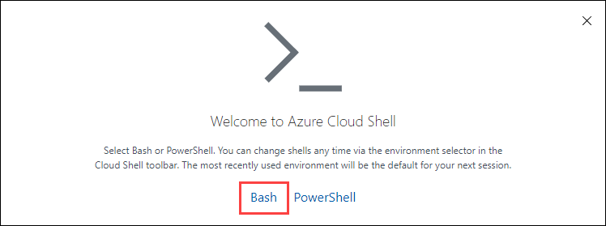
   
1. Check that the correct subscription is specified and select **Create storage** if you are asked to create storage for your cloud shell. Wait for the storage to be created.

   
   
1. In the terminal, enter the following commands to clone this repo:

    ```azurecli
    rm -r azure-ml-labs -f
    git clone https://github.com/MicrosoftLearning/mslearn-azure-ml.git azure-ml-labs
    ```

    > NOTE: Use `SHIFT + INSERT` to paste your copied code into the Cloud Shell.

    

1. After the repo has been cloned, enter the following commands to change to the folder for this lab and run the **setup.sh** script it contains:

    ```azurecli
    cd azure-ml-labs/Labs/08
    ./setup.sh
    ```

    > NOTE: Ignore any (error) messages that say that the extensions were not installed.

1. Wait for the script to complete - this typically takes around 5-10 minutes.

## Task 2: Clone the lab materials

When you've created the workspace and necessary compute resources, you can open the Azure Machine Learning studio and clone the lab materials into the workspace.

1. In the Azure portal, navigate to the Azure Machine Learning workspace named **mlw-dp100-...**.

   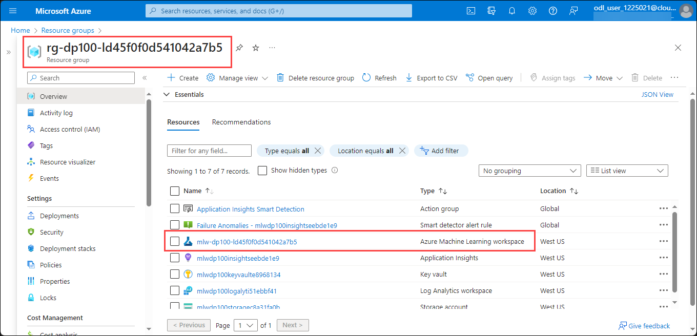
   
1. Select the Azure Machine Learning workspace, and in its **Overview** page, select **Launch studio**. Another tab will open in your browser to open the Azure Machine Learning studio.

   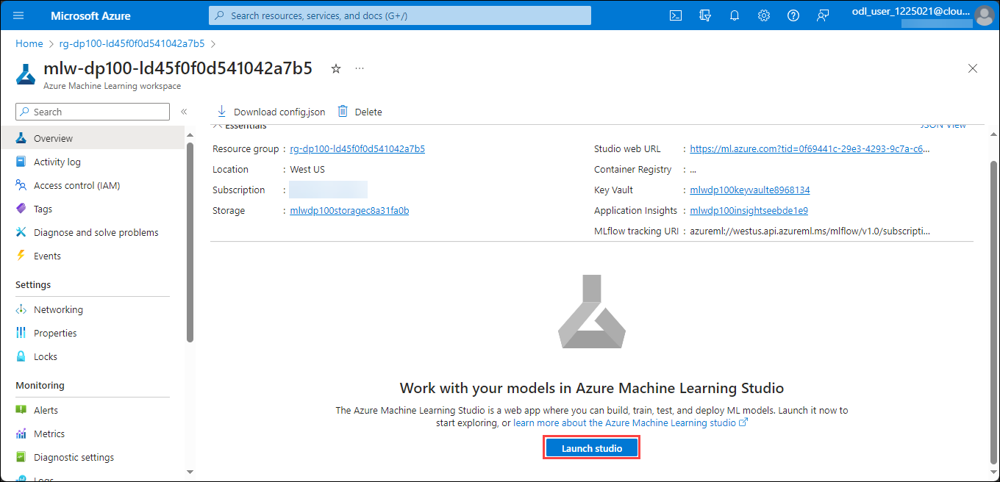
   
1. Close any pop-ups that appear in the studio.
   
1. Within the Azure Machine Learning studio, navigate to the **Compute** page and verify that the compute instance and cluster you created in the previous section exist. The compute instance should be running, the cluster should be idle and have 0 nodes running.

   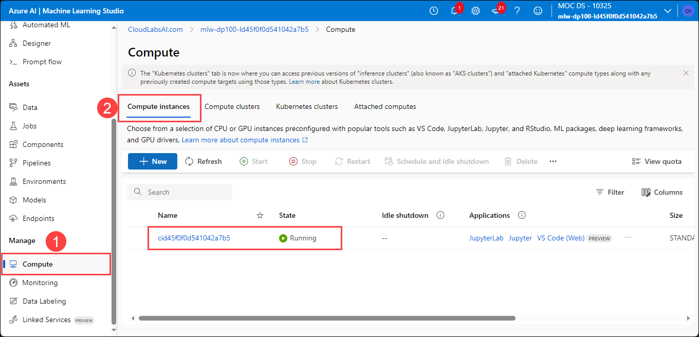

   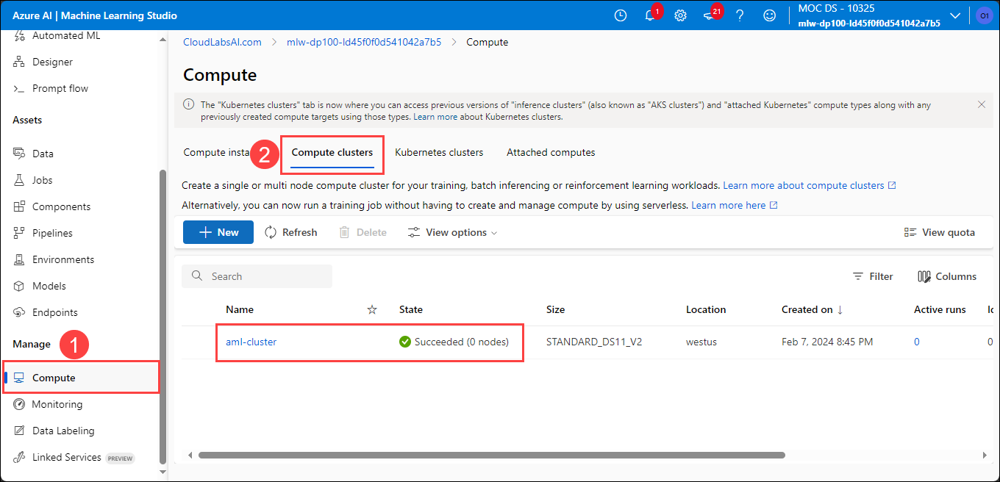
   
1. In the **Compute instances** tab, find your compute instance, and select the **Terminal** application.

   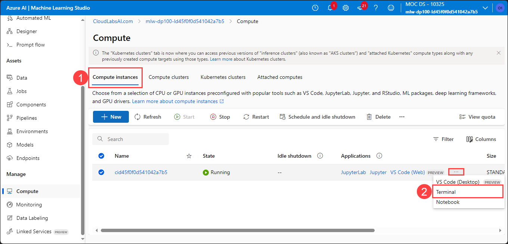
   
1. In the terminal, install the Python SDK on the compute instance by running the following commands in the terminal:

    ```
    pip uninstall azure-ai-ml
    pip install azure-ai-ml
    ```

    > NOTE: Ignore any (error) messages that say that the packages couldn't be found and uninstalled.

    

1. Run the following command to clone a Git repository containing notebooks, data, and other files to your workspace:

    ```
    git clone https://github.com/MicrosoftLearning/mslearn-azure-ml.git azure-ml-labs
    ```
    
    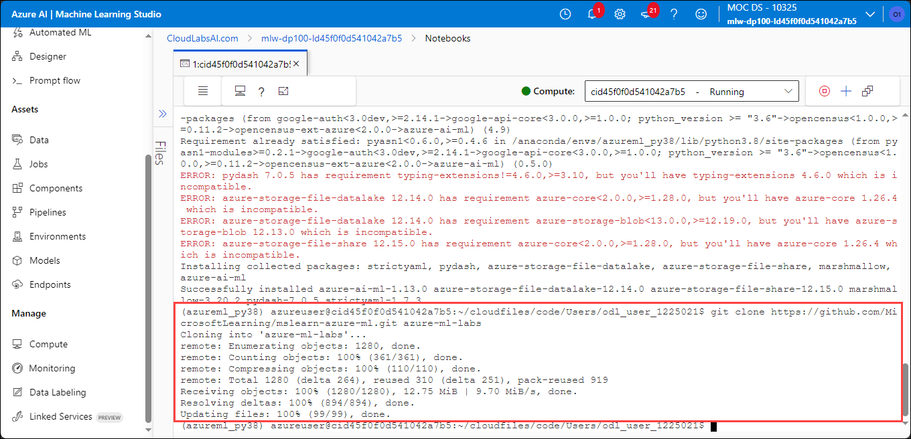

1. When the command has completed, in the **Files** pane, click **&#8635;** to refresh the view and verify that a new **Users/*your-user-name*/azure-ml-labs** folder has been created.

   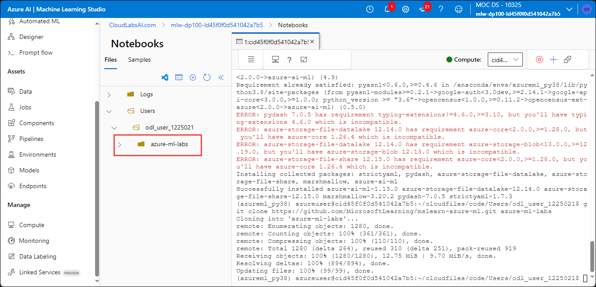

## Task 3: Submit MLflow jobs from a notebook

Now that you have all the necessary resources, you can run the notebook to submit the job, which uses MLflow to track model parameters, metrics, and artifacts.

1. Open the **Labs/08/Use MLflow to track jobs.ipynb** notebook.

   > NOTE: Select **Authenticate** and follow the necessary steps if a notification appears asking you to authenticate.

   

1. Verify that the notebook uses the **Python 3.8 - AzureML** kernel.

   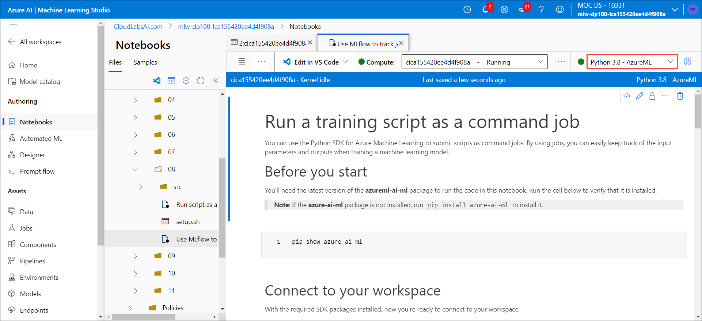
   
1. Run all cells in the notebook individually by clicking on the **Run cell** button.

   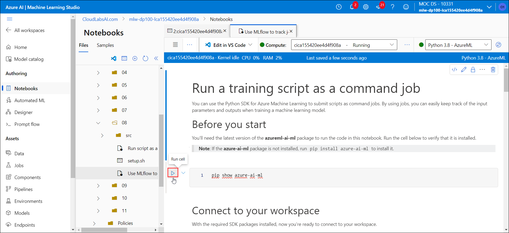

## Task 4: Delete Azure resources

When you finish exploring Azure Machine Learning, you should delete the resources you've created to avoid unnecessary Azure costs.

1. Close the Azure Machine Learning studio tab and return to the Azure portal.
   
1. In the Azure portal, on the **Home** page, select **Resource groups**.
   
1. Select the **rg-dp100-...** resource group.

   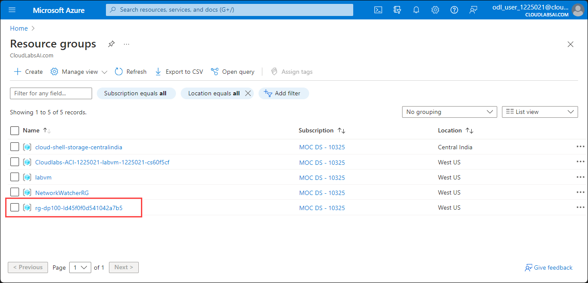
   
1. At the top of the **Overview** page for your resource group, select **Delete resource group**.

   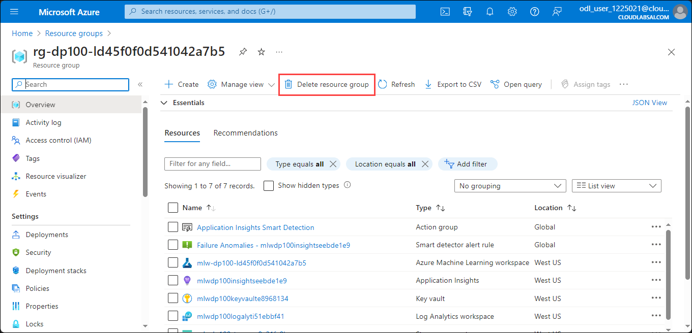
   
1. Enter the resource group name to confirm you want to delete it, and select **Delete**.

   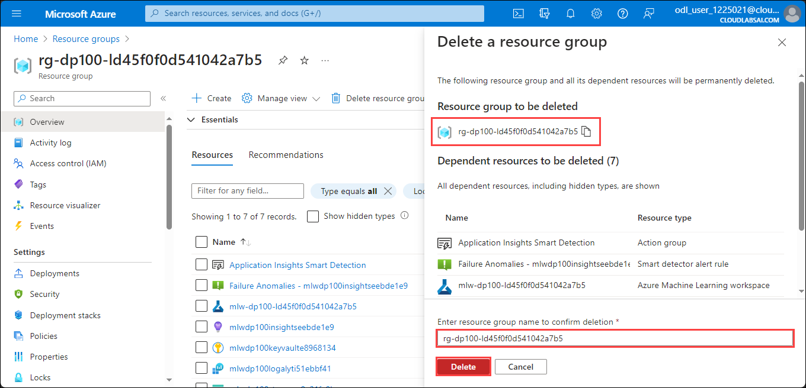

## Review

In this lab you have completed the following tasks:

- Provisioned an Azure Machine Learning workspace
- Cloned the lab materials
- Used MLflow to track training jobs
- Deleted Azure resources
