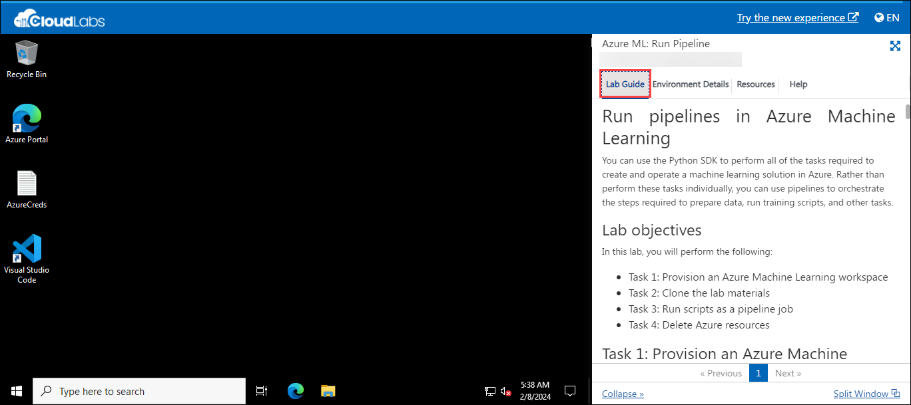
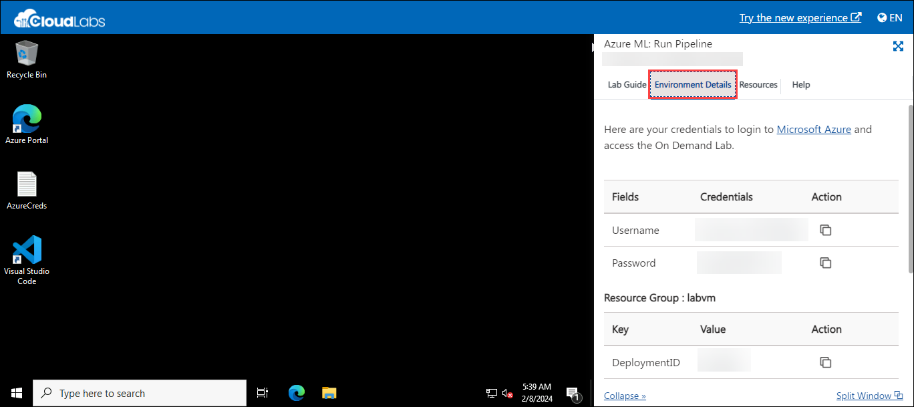
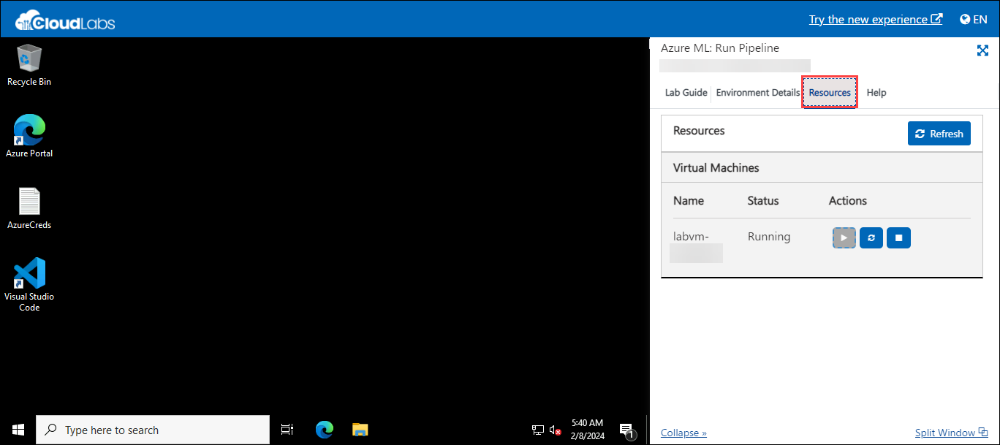
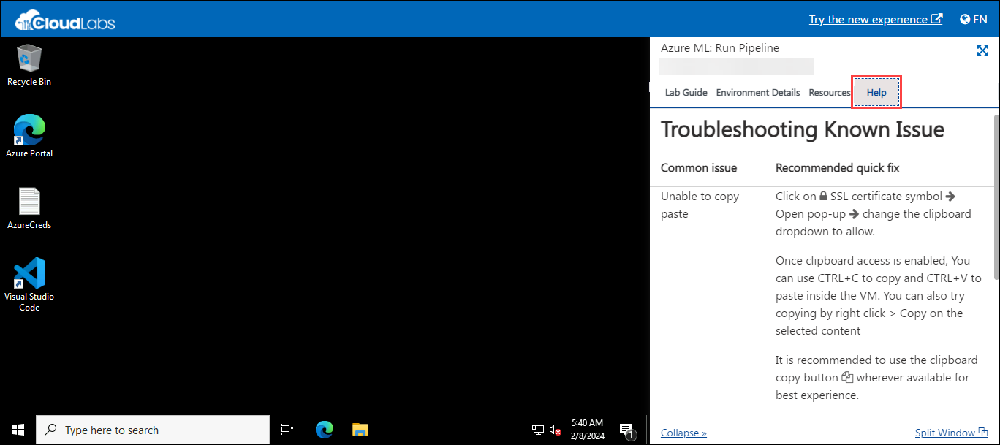
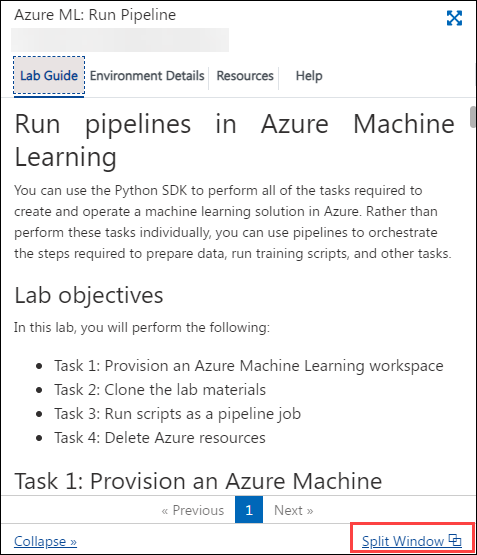

# Getting Started

1. Once the environment is provisioned, a virtual machine and lab guide will be loaded into your browser. Use this virtual machine to perform the lab.

   

1. To get the lab environment details, select the **Environment Details** tab.

   

1. You can also **Start, Restart and Deallocate** the virtual machine from the **Resources tab**.

   

1. The **Help** tab assists you in fixing the common issues.

   

1. Click on **Next** from the bottom right corner and follow the instructions to perform the lab.

   

1. You can also open the Lab Guide in a separate full window by selecting the **Split Window** button in the bottom right corner.

   
